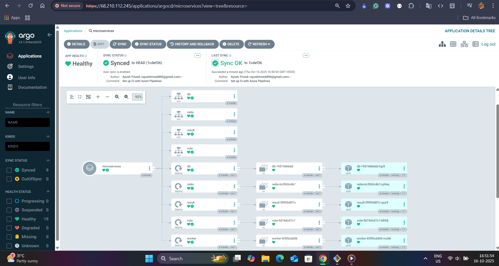
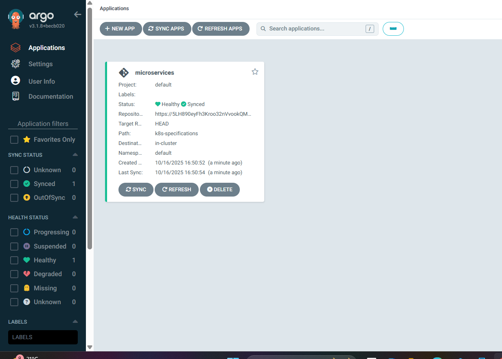

# Azure DevOps – Automated Voting Application CI/CD Pipeline

## Overview
This project demonstrates an end-to-end **Continuous Integration (CI)** and **Continuous Deployment (CD)** setup using **Azure DevOps** for a distributed, containerized voting application.  
The application enables users to vote between two options and view real-time results, integrating multiple microservices built with **Python**, **.NET**, **Redis**, **PostgreSQL**, and **Node.js**.  
It implements industry-grade DevOps practices with automation, scalability, and cloud-native deployment through **Azure Kubernetes Service (AKS)**.

---

# Project Link:
👉 `https://ayushtrivedi890@dev.azure.com/ayushtrivedi890/Voting-app/_git/Voting-app` 👈

## Architecture
The solution consists of the following components:
- **Front-End (Python):** Web interface for users to vote.
- **Redis:** Collects and caches incoming votes.
- **Worker (.NET):** Processes votes and stores them in the database.
- **Database (PostgreSQL):** Persistent data layer backed by Docker volumes.
- **Results App (Node.js):** Displays live voting results.

All services are containerized using **Docker** and orchestrated through **AKS**, while **ArgoCD** continuously syncs the Kubernetes manifests from the Git repository to ensure desired state consistency.

---

## Key Features
- **Azure DevOps CI:** Automated build, test, and image push to **Azure Container Registry (ACR)**.
- **ArgoCD CD:** GitOps-based continuous deployment to **AKS**.
- **Containerized Microservices:** Ensures portability and consistency across environments.
- **Scalable Deployment:** Leveraging **AKS** with **Virtual Machine Scale Sets (VMSS)**.
- **Automated Rollbacks:** Managed through ArgoCD for reliability.
- **Real-Time Data Processing:** Efficiently handled by Redis and .NET worker integration.

---

## Technology Stack
| Component         | Technology Used |
|--------------------|----------------|
| CI/CD Framework    | Azure DevOps + ArgoCD |
| Front-End          | Python (Flask) |
| Worker             | .NET Core |
| Data Store         | Redis |
| Database           | PostgreSQL (Docker volume) |
| Results Dashboard  | Node.js |
| Containerisation   | Docker |
| Orchestration      | Azure Kubernetes Service (AKS) |
| Scaling            | Azure Virtual Machine Scale Sets (VMSS) |

---

## Pipeline Workflow

### Continuous Integration (Azure DevOps)
1. **Code Commit:** Developer pushes code to the repository.  
2. **Build Trigger:** Azure DevOps initiates the CI pipeline.  
3. **Unit Testing:** Automated tests validate code quality.  
4. **Image Build:** Docker images are built and pushed to **Azure Container Registry (ACR)**.

### Continuous Deployment (ArgoCD)
1. **GitOps Deployment:** ArgoCD continuously monitors the Git repository for manifest changes.  
2. **Sync Process:** Updates are automatically deployed to the **AKS** cluster.  
3. **Health Monitoring:** ArgoCD dashboard tracks application health and rollout progress.  
4. **Auto-Rollback:** Automatically restores previous stable versions if deployment issues occur.

---

### Prerequisites
- Azure Subscription with **AKS** and **ACR**
- **Azure CLI**, **kubectl**, and **Docker** installed locally
- **ArgoCD** installed and configured in AKS
- Access to **Azure DevOps Pipelines**

### Screenshots

